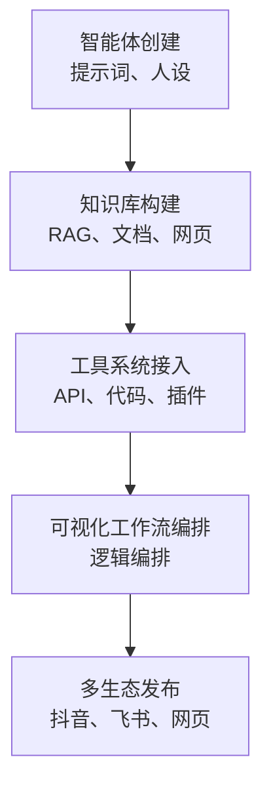

# 扣子智能体构建平台：功能、能力与应用

## 4.1 平台定位与设计理念

扣子（Coze）是字节跳动推出的一体化智能体构建平台，其核心目标是为开发者与普通用户提供一个低门槛、可视化、可扩展的智能体开发与运行环境。用户无须具备深厚的编程能力，即可快速创建并部署具备任务执行、工具调用、知识连接与多生态发布能力的智能体应用。

与传统基于模型调用的对话式系统不同，扣子强调从“语言模型”向“可行动智能体”的演进，实现从内容生成到任务执行的闭环。

平台整体结构包括以下五大核心模块：

- 智能体创建：提示词、人设、行为边界配置。
- 知识库构建：支持 RAG、文档、网页等知识接入。
- 工具系统接入：支持 API、代码、插件等外部能力调用。
- 可视化工作流编排：通过流程节点进行逻辑编排。
- 多生态发布：支持抖音、飞书、网页等多平台部署。

**图 4.1 扣子平台的整体结构图**

在平台定位上，扣子不仅面向个人创作者和企业开发者，也面向需要快速构建业务自动化流程、客服知识库系统、内容分发系统、企业机器人集成等场景的用户。

通过对自然语言交互、插件扩展能力以及可视化编排的深度整合，扣子为智能体产业提供了更高层级的抽象，降低了智能体应用开发的技术门槛，并显著缩短了从原型到落地的周期。

### 平台核心理念

#### 1. 自然语言即编程

用户无须编写代码，即可通过自然语言描述需求或编写提示词，定义智能体的角色定位、任务边界和交互方式，实现智能体行为逻辑的快速构建。

这一理念对应提示工程范式，使非技术人员也能够参与智能体开发。

#### 2. 插件化工具调用

平台支持内置工具与自定义扩展工具，包括 API 调用、数据库访问、函数执行、联网查询等，从而扩展智能体的行动范围。

借助插件化工具调用，智能体不仅能够生成文本，还能够执行真实操作，成为可与外部系统协同工作的“行动智能体”。

#### 3. 统一工作流引擎

平台提供可视化流程编辑界面，用于构建多步骤、多条件、多工具协同的复杂任务智能体。

用户可通过节点与连接关系定义任务逻辑，实现可视化的自动化流程编排，提升系统的可理解性与可维护性。

#### 4. 多生态发布

构建完成的智能体可直接发布到扣子应用商店、飞书、抖音、巨量引擎等平台，也可通过 API 嵌入第三方系统。

这使智能体具备跨平台分发能力与产品级部署能力，形成从开发到应用落地的完整生态闭环。

### 小结

基于上述理念，扣子平台在智能体构建流程中实现了高度集成化和模块化。它将“自然语言定义行为”“插件化扩展能力”与“可视化逻辑编排”结合，构建出一种面向未来智能体应用的统一开发模式。

这种模式不仅降低了智能体开发成本，也为复杂业务场景中的自动化系统提供了可扩展、可维护与可持续演化的技术路径。

---

## 4.2 扣子的核心功能模块

### 4.2.1 智能体创建

扣子提供完整的智能体定义界面，使开发者无须编写代码即可构建具备人格特征与行为逻辑的智能体。

该模块通过将结构化表单与自然语言结合，实现智能体的“人格初始化”。

核心功能包括：

- **人设配置**：包括身份定位、角色职责、语言语气等，用于形成持续一致的交互体验。
- **系统提示词**：用于限定推理框架、知识边界及任务逻辑，确保智能体在长期使用中保持行为稳定。
- **行为约束与边界条件**：包括禁止操作、敏感权限限制、合规性要求，使任务执行具有可控性。
- **输出格式与风格规范**：支持结构化输出，例如 JSON、表格等，也支持内容风格统一，便于系统对接。

从智能体架构的角度看，该模块相当于智能体系统的策略初始化（Policy Initialization），决定了智能体的推理方式与输出习惯。

---

### 4.2.2 知识库

知识库模块为智能体提供检索增强能力，使其能够引用外部知识并进行上下文相关推理。

扣子支持的知识源输入格式包括：

- PDF、Word、PPT、EPUB 等文档。
- 产品手册、SOP、FAQ 等结构化资料。
- Markdown 文档、技术说明文件。
- URL 与网页抓取内容。
- Excel、CSV 等数据表格。

系统会自动进行文档解析、结构化提取、内容清洗与向量化索引构建，使智能体具备以下能力：

- 精准的专业领域问答能力。
- 基于文档的摘要、比对与论证能力。
- 结合企业内部资料的自定义业务问题回答能力。

通过知识库，智能体能够突破模型本身的知识边界，实现企业级知识问答与任务执行。

---

### 4.2.3 智能体技能：工具与插件系统

工具系统是扣子从“语言模型”向“可行动体”（Action Agent）演进的关键。

平台提供丰富的内建工具，同时支持开发者扩展自定义工具。典型工具能力包括：

- **联网搜索**：实时获取公开网络数据、新闻、百科与动态信息。
- **调用 API**：支持通过 REST API、Webhook 等方式与外部系统交互，可实现查询、写入、下单、推送消息等功能。
- **执行代码**：直接运行 Python 或 JavaScript，用于计算、数据处理、模型推理或图形生成。
- **数据库读写**：支持 SQL 查询及企业数据系统对接。
- **图像类工具**：支持 OCR、表格识别、PDF 解析、图像分类等。
- **第三方插件**：如天气、翻译、知识库工具、客服系统等。

借助工具系统，智能体能够执行操作性任务，形成从“能回答”到“能行动”的能力跃迁。

---

### 4.2.4 工作流

工作流是扣子的核心竞争力之一。它通过可视化流程图将复杂任务拆解为可复用、可编排的自动化链条，使开发者在无须代码的情况下实现复杂任务自动化。

工作流支持以下功能：

- **多步骤任务编排**：将任务拆解为连续执行的步骤节点。
- **条件分支**：包括 Else 与 Switch，用于构建复杂决策逻辑。
- **多工具串联**：将多个工具按顺序或规则连通，实现完整业务流程。
- **循环与迭代**：支持对列表、数据集进行重复计算。
- **输入输出节点**：明确工作流的输入参数与最终输出，便于系统调用。

工作流本质上相当于一套可视化的自动化编排引擎（Visual Orchestration Engine），适用于自动化办公、业务流程调度、批量数据处理等场景。

---

### 4.2.5 发布与生态集成

智能体构建完成后，可在多生态场景中一键部署，实现跨平台可用和产品级落地。

发布渠道包括：

- **扣子商店**：便于公开分发，触达终端用户。
- **飞书机器人与工作台**：支持企业工作流自动处理。
- **抖音搜索、评论与直播助手**：应用于内容创作、客服、直播运营。
- **巨量引擎广告生态**：面向广告投放、客户咨询与智能营销场景。
- **外部网站与 API**：作为业务系统的智能模块直接调用。

丰富的生态让智能体从“可开发”走向“可运行、可分发、可商业化”，形成“开发—编排—部署—运营”的完整闭环。

---

## 4.3 使用扣子能实现哪些类型的应用

扣子通过“知识库 + 工具系统 + 工作流引擎 + 多生态发布”的组合能力，使智能体从单纯的对话问答系统，扩展为可执行任务、生成内容、驱动业务流程与提供真实服务的多类型应用形态。

根据核心能力侧重点不同，基于扣子构建的智能体大致可划分为以下五类。

---

### 4.3.1 知识型智能体

知识型智能体以知识获取和知识利用为核心，通过向量化检索与内容理解实现特定领域知识的问答与推理。

适用场景包括：

- 产品问答与售前咨询。
- 医疗、法律、教育等专业咨询场景。
- 文档问答与学术论文检索。
- 企业内部 FAQ 自动化与知识管理。

此类智能体通常依赖以下技术：

- 知识库构建，例如 PDF、网页、手册等。
- 检索增强生成（RAG）。
- 提示工程。

知识型智能体的典型优势是能够将静态文档转化为可交互的知识系统，实现对企业内部资料、产品说明书、培训文档等信息的动态访问，提升知识获取效率与服务质量。

---

### 4.3.2 工具型智能体

工具型智能体不仅能够提供内容回答，还能够主动调用外部能力执行真实操作，形成“输出即行动”的闭环。

智能体可以执行以下操作：

- 查询数据库或 CRM 系统。
- 发送 Webhook 触发业务流程。
- 执行 Python 程序进行数据分析或计算。
- 调用外部服务 API，例如翻译、物流、订单系统等。

适用场景包括：

- 自动化办公，例如报表生成、审批提醒。
- 数据处理与清洗。
- 业务运营管理。
- 企业内部系统联动。

工具型智能体本质上是“可执行任务的智能代理”，具备替代人工完成重复性操作的能力，能够显著提升效率，减少人工干预成本。

---

### 4.3.3 创意型智能体

创意型智能体以内容生成与创意表达为核心，适用于以下生成类任务：

- 文案、脚本、宣传内容创作。
- 短视频分镜脚本生成。
- PPT、设计稿、活动策划方案生成。
- 绘图、绘本、海报自动生成。

这类智能体通常与模型能力结合，例如：

- 文本生成模型，例如豆包。
- 图像生成工具，例如 Stable Diffusion、DALL·E。
- 视频生成工具。

创意型智能体为内容创作者提供了高效的生产工具，实现从“灵感构思”到“初稿输出”的一体化支持，特别适合内容电商、短视频团队、广告策划与教育内容制作等场景。

---

### 4.3.4 工作流型智能体

工作流型智能体强调流程执行与任务编排，能够自动完成包含多个步骤的复杂业务流程。

典型流程包括：

- 合同审核 → 条款提取 → 风险标注 → 修改建议生成。
- 飞书审批 → 表格读取 → 数据合并 → 自动生成报告。
- 直播间评论监控 → 意图分类 → 自动回复 → 标签统计。

这类智能体通过可视化工作流实现以下功能：

- 多工具串联。
- 条件判断与逻辑分支。
- 数据流转换与多步骤执行。

工作流型智能体的运行方式更接近企业级自动化机器人，能够替代人工执行结构化流程，具有较高的落地价值。

---

### 4.3.5 服务型智能体

服务型智能体面向真实用户使用场景，直接参与面向公众或客户的交互服务。

典型应用包括：

- 客服助理与售后支持。
- 课程讲解、培训指导、健康咨询助手。
- 营销投放咨询、选品助手。
- 小程序或网站内置 AI 模块。

此类智能体通常需要具备以下特点：

- 稳定性。
- 响应一致性。
- 可控性，即行为可预期。
- 安全与合规性，特别是在医疗、金融等领域。

服务型智能体的核心目标是提供可持续使用的智能服务能力，提升用户体验与服务效率。

---

## 4.4 总结

总体而言，扣子能够支持从知识服务到业务自动化、从内容创作到真实用户服务的多类型智能体构建，形成覆盖个人创作者与企业应用的完整应用谱系。

其核心价值体现在以下方面：

- 通过自然语言与提示词降低智能体开发门槛。
- 通过知识库与 RAG 增强专业知识问答能力。
- 通过工具和插件系统扩展智能体的行动能力。
- 通过可视化工作流实现复杂业务流程自动化。
- 通过多生态发布能力推动智能体从开发走向实际应用。

因此，扣子不仅是一个智能体创建工具，更是一个集开发、编排、部署与运营于一体的智能体构建平台。
