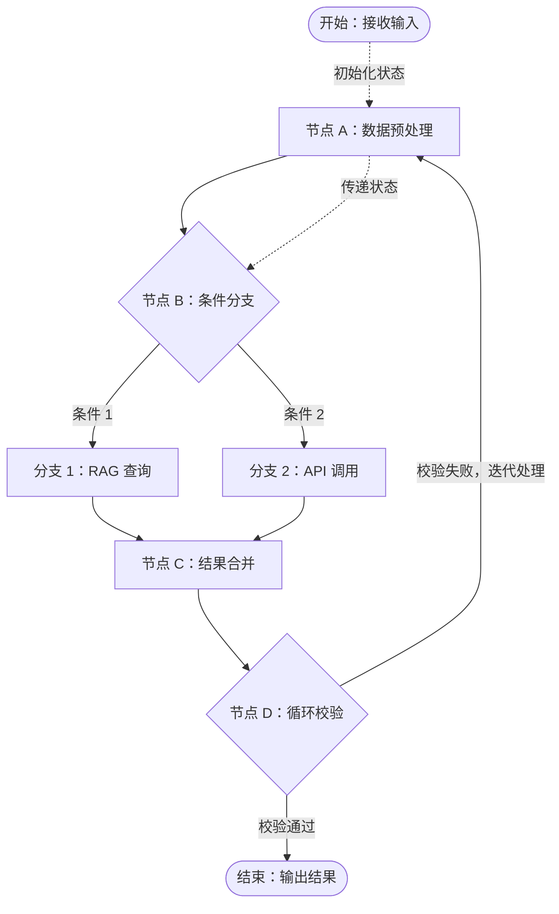
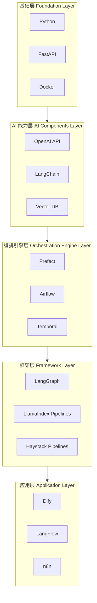
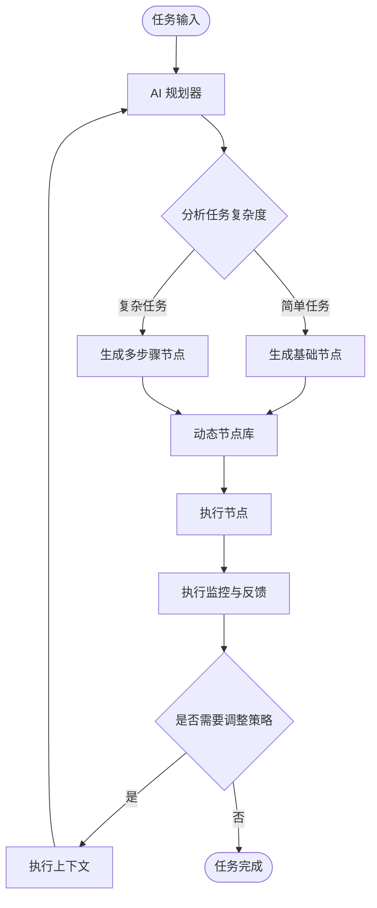

---
# 构建 AI 工作流：复杂任务的编排与自动化

随着企业对 AI 应用需求的不断深化，单一的检索增强生成（RAG）系统或独立的大语言模型（LLM）调用已难以满足复杂业务场景的要求。现实中的业务任务往往需要多个步骤的协同处理、多种 AI 能力的有机组合，以及在执行过程中根据中间结果动态调整处理策略。

AI 工作流（AI Workflow）技术应运而生，它通过将多个 AI 组件、传统算法和外部服务编排成有序的执行流程，实现了复杂任务的自动化处理。这种编排能力不仅提升了 AI 应用处理复杂问题的能力边界，还为企业级 AI 应用的规模化部署提供了标准化的技术范式。

学习步骤：

1. 首先，将从概念层面明确 AI 工作流的定义，剖析单点 AI 应用在处理复杂任务时的局限性，并阐明 AI 工作流在任务分解、异构能力集成、可靠性保障等方面的核心价值。
2. 其次，将系统性地解析 AI 工作流的技术原理，包括节点类型与连接机制、条件分支与循环控制、状态管理与变量传递、并行执行与同步机制，以及错误处理与容错机制等关键技术要素。
3. 最后，将梳理当前 AI 工作流的技术生态，从基础层到应用层的五层分层架构，提供面向不同场景的技术选型策略，并展望从静态 AI 工作流到动态自适应 AI 工作流的演进路径。

学习目标：

- 建立起对 AI 工作流的系统认知，理解其作为连接单一的 LLM 能力与高级 Agent 系统的桥梁作用，为后续对企业业务自动化的理解和实践奠定坚实的理论基础。

---
## 概念缘起与应用价值

下面我们从其基本定义出发，深入剖析单点 AI 组件在处理复杂任务时面临的固有局限，并在此基础上系统性地阐明 AI 工作流的核心应用价值与主要应用场景。通过理解 AI 工作流产生的必然性及其解决的关键问题，将认识到这一技术范式在企业级 AI 实践中的重要地位。

### AI 工作流的基本概念

要准确把握 AI 工作流的内涵，需要从其**技术演进与定位**、**核心定义**和**关键组成要素**三个层面进行系统性理解。下面我们依次展开详细介绍：
	1. 首先梳理 AI 工作流的技术演进脉络并明确其在 AI 技术体系中的定位；
	2. 其次提炼其核心定义，阐明其技术本质；
	3. 最后解构其关键组成要素，剖析其技术架构。

#### 1. 技术演进与定位

AI 工作流的概念源于传统工作流管理系统（Workflow Management System）与现代 AI 技术的深度融合。传统工作流技术自 20 世纪 90 年代起就广泛应用于业务流程自动化，但 AI 工作流作为一个独立的技术概念，是伴随着大模型的成熟而兴起的新兴领域。

2022 年 ChatGPT 发布后，随着大模型、向量数据库、Agent 框架等 AI 技术栈的快速发展，将这些 AI 能力作为工作流节点进行编排成为可能。2023 年以来，随着 LangChain 框架中工作流编排能力的完善、LlamaIndex 的 Workflow 模块等专门面向 AI 场景的编排工具的推出，AI 工作流作为独立的技术范式得到了业界的广泛认可。

AI 工作流在技术体系中的定位介于单一 AI 组件（如独立的LLM或RAG）和完全自主的 AI Agent 之间，它提供了一种可控、可预测、可扩展的复杂任务处理方案。

#### 2. 核心定义

AI 工作流是一种将多个 AI 组件、数据处理模块和外部服务通过预定义或动态生成的执行逻辑连接起来，以实现复杂任务自动化处理的技术架构。

其技术本质在于将原本需要人工协调的多步骤 AI 任务转化为可自动执行的流程，同时保持执行过程的**可观测性**、**可干预性**和**可复现性**。与单一的大模型调用不同，AI 工作流强调多个处理步骤之间的**协同**与**编排**，以及在执行过程中的**状态管理**与**错误处理**。

#### 3. 关键组成要素

AI 工作流的技术架构可被解构为一系列协同工作的组成要素。其中，节点、连接与编排引擎构成了其最基础的技术架构。这三大要素各司其职，共同确保了 AI 工作流的稳定与高效运行。

| 核心要素 | 核心定义                           | 具体类型 / 主要职责                             |
| ---- | ------------------------------ | --------------------------------------- |
| 节点   | AI 工作流中的基本执行单元，负责完成一项特定任务      | 包含输入 / 输出节点、AI 处理节点、数据处理节点、逻辑控制节点四种主要类型 |
| 连接   | 定义节点之间的数据流向和执行顺序，是 AI 工作流逻辑的载体 | 包括顺序连接、条件连接、并行连接、循环连接                   |
| 编排引擎 | AI 工作流的执行引擎，负责协调和管理整个执行过程      | 负责解析与调度、状态管理、并发控制、容错与监控                 |

综上所述，通过节点实现任务的模块化，通过连接编排复杂的业务逻辑，再由编排引擎驱动整个流程的自动化执行，AI 工作流为企业级 AI 应用提供了一种既灵活又稳健的技术实现路径。

---
### 单点 AI 应用的内在局限

在明确了 AI 工作流的基本构成后，有必要深入分析其解决的主要问题，即单点 AI 应用（如一个独立的 RAG 系统或一次性的大模型调用）在应对复杂业务场景时所暴露出的内在局限。
这些局限性正是催生 AI 工作流技术发展的直接原因。

#### 1. 复杂任务的流程割裂

单点 AI 应用本质上采用单轮“请求—响应”模式，难以处理需要多个连续步骤才能完成的复杂任务。

现实世界的业务流程往往是环环相扣的。例如，一个完整的市场分析报告生成任务可能包括：

	1. 利用 RAG 系统从多份行业研报中提取关键数据；
	2. 调用代码执行模块对数据进行统计分析并生成图表；
	3. 由大模型将数据、图表和结论整合成一份结构化分析报告。

若使用单点 AI 应用，则需要人工串联每一步操作并手动传递中间结果，整个过程是割裂且低效的。

#### 2. 异构工具的集成困难

现代 AI 应用常常需要将大模型能力与多种外部工具结合，以完成超越纯文本生成的任务。这些工具可能包括：

- 用于精确计算的代码执行环境；
- 用于访问实时数据的 API；
- 用于操作企业内部数据的 SQL 数据库。

单点 AI 应用自身通常既不具备调用这些异构工具的能力，也缺乏统一的接口规范来管理工具的认证、输入输出和错误处理。这种能力缺失导致其应用场景被严重限制在信息检索和内容生成范围内。

#### 3. 动态逻辑控制的缺失

业务流程中普遍存在复杂的逻辑判断与控制需求，而单点 AI 应用缺乏原生的流程控制机制。

例如，在智能客服场景中，系统需要根据用户问题类型决定下一步操作：

- 对于信息咨询类问题，调用 RAG 系统回答；
- 对于业务办理类问题，调用相关业务 API；
- 对于复杂或无法识别的问题，转人工或创建工单。

单点 AI 应用无法执行此类条件分支（If/Else）逻辑。同样，它也无法实现循环（Loop）操作。例如，当生成内容未能通过质量校验时，无法自动返回上一步进行修改和重新生成，直至满足要求。

#### 4. 执行过程的健壮性与可观测性不足

当通过简单脚本将多个 AI 调用串联起来时，整个系统的健壮性会非常脆弱。链条中的任何环节出现网络超时、API 调用失败或返回格式错误，都可能导致整个任务中断。

此外，这种临时组合方式也缺乏系统性的状态管理和监控机制。一旦出现问题，很难快速定位到具体故障节点和原因，使调试和运维难度大大增加，不满足企业级 AI 应用对稳定性和可靠性的要求。

---
### AI 工作流的核心应用价值

针对单点 AI 应用暴露的局限，AI 工作流提供了一套系统性的解决方案。其核心应用价值体现在将复杂业务流程进行**模块化拆解**与**流程化编排**，从而在任务处理的**灵活性**、**扩展性**和**可靠性**方面实现质的提升。

#### 1. 任务分解与流程自动化

AI 工作流的首要价值在于==其能够将一个复杂的综合任务分解为一系列定义清晰、功能独立的节点，并以预设流程将这些节点自动化连接起来。==

这种模式将原先需要人工干预的多个步骤固化为一套可自动执行的程序，实现端到端流程自动化。这不仅极大提升了处理效率，而且确保了复杂任务执行过程的一致性和标准化。

#### 2. 异构能力集成与扩展

通过标准化的节点封装机制，AI 工作流能够将不同来源、不同类型的能力无缝集成到一个统一流程中，例如：

	- RAG；
	- 代码执行环境；
	- API；
	- 数据库；
	- 企业内部系统。

它提供了标准化接入机制，允许开发者更方便地将各种工具集成到 AI 工作流中。这种强大的集成能力极大扩展了 AI 应用边界，使其能够与企业现有 IT 基础设施和外部服务深度交互，完成更加复杂和多样化的任务。

#### 3. 复杂逻辑的精确编排

AI 工作流原生支持**条件分支**、**并行处理**、**循环执行**等复杂流程控制逻辑。编排引擎可以根据特定节点的输出结果，动态决定后续执行路径，从而实现高度灵活和智能的业务流程。

例如，可以编排一个“生成、评审、修改”的循环，直到生成内容符合预设质量标准。这种精确的逻辑编排能力，使 AI 工作流不再只是简单线性执行，而是能够模拟复杂决策过程。

#### 4. 增强系统的健壮性与可观测性

专业的 AI 工作流框架通常内置完善的错误处理和重试机制。开发者可以为每个节点配置独立容错策略，例如：

	- 当 API 调用失败时自动重试；
	- 当主服务不可用时切换到备用方案；
	- 当自动化流程无法处理时转入人工介入。

同时，编排引擎会详细记录工作流每一步的执行日志、输入输出和状态变化，提供系统完整运行过程的可观测性。这使开发者能够轻松追踪任务完整执行轨迹，在出现故障时快速诊断问题，从而保障企业级应用稳定运行。

---
### AI 工作流的主要应用场景

由于在**任务自动化**、**能力集成**和**逻辑编排**方面的价值，AI 工作流已在多领域展现出广泛应用潜力。

#### 1. 自动化内容生成与处理

内容创作并非单一生成动作，而是包含资料研究、草稿撰写、事实核验、格式编排等多环节的复杂流程。AI 工作流能够帮助整个流程自动化。

例如，在生成一份深度市场分析报告时，可以设计如下 AI 工作流：

	1. 通过 RAG 节点从指定知识库中检索相关数据和观点；
	2. 将检索内容输入大模型节点，生成报告初稿；
	3. 启动事实核验节点，将报告中的关键数据与原始来源比对；
	4. 根据预设模板，由格式化节点将通过核验的内容自动排版输出。

实际部署时，建议采用**人机协作**方式，**在关键环节保留人工审核**。

#### 2. 复杂数据分析与洞察提取

企业在进行数据驱动决策时，往往需要处理来自不同系统、不同结构的异构数据。AI 工作流能够编排相对完整的数据处理与分析流水线。

一个典型的数据分析工作流可以这样构建：

1. 起始节点从 PDF 财报、业务数据库、CSV 文件等多个数据源抽取原始数据；
2. 数据处理节点对异构数据进行清洗、转换和对齐；
3. AI 分析节点接收自然语言形式的分析指令，并将其转化为精确的数据库查询语言，如 SQL；
4. 执行查询并获得数据后，另一个 AI 节点对结果进行统计摘要、趋势识别，并生成易于理解的自然语言结论。

这类应用的成功很大程度上依赖数据质量和业务逻辑复杂程度。

#### 3. 智能交互与响应系统

在智能客服、服务助手等交互式应用中，系统需要根据用户意图差异，执行不同操作并调用相应工具。AI 工作流为此类场景提供了有效实现框架。

例如，一个企业内部 IT 支持系统可以通过 AI 工作流实现如下逻辑：

1. 意图识别节点对用户请求进行分类；
2. 条件分支将请求分配到不同处理路径；
3. 若用户意图是查询知识库，则激活 RAG 流程；
4. 若用户意图是重置密码或申请权限，则调用相应内部 IT 系统 API；
5. 若用户意图复杂或无法识别，则自动创建工单并指派给人工支持团队。

通过这种方式，AI 工作流使系统能够执行超越简单问答的、与业务流程深度绑定的交互任务。

---
## AI 工作流核心工作原理解析

在对 AI 工作流的概念、价值与应用场景建立整体认知后，我们来深入其技术内部，系统性解析支撑 AI 工作流运行的核心工作原理。

学习步骤：

1. 从构成工作流的基础单元节点与连接机制开始
2. 逐步深入实现动态流程控制的条件分支与循环
3. 再到确保信息在流程中顺畅流转的状态管理机制，以及提升执行效率的并行与同步策略
4. 最后覆盖保障系统稳定运行的错误处理与容错机制

学习目标：

- 通过对这些底层原理的解构，理解 AI 工作流是如何从一系列独立任务单元，组合成一个能够自动化执行复杂任务的有机整体。

### AI 工作流核心工作原理示意图



如图所示，一个典型 AI 工作流由编排引擎进行管理，负责初始化并传递工作流状态，根据预设拓扑结构依次调度各个节点。该结构可以包含条件分支、循环等复杂逻辑，最终将处理结果输出。

---
### 节点类型与连接机制

下面详细阐述构成 AI 工作流拓扑结构的两个基础元素：节点与边。

- 节点是 AI 工作流的基本执行单元
- 边定义这些单元之间的数据与控制流

二者共同构成 AI 工作流的静态结构。

#### 1. 节点

节点是 AI 工作流中被编排与调度的基本功能模块，每个节点负责执行一项具体的、独立的任务。
通过将复杂流程分解为一系列标准化节点，AI 工作流实现了高度模块化与可复用性。

<div align="center">AI工作流节点功能特性类型表</div>

| 节点类型      | 定义                             | 典型示例                           |
| --------- | ------------------------------ | ------------------------------ |
| 输入 / 输出节点 | 负责 AI 工作流与外部系统交互，是流程起点和终点      | 接收用户 HTTP 请求、读取本地文件、返回 JSON 响应 |
| AI 处理节点   | 封装并调用各类 AI 模型或算法，是 AI 工作流的智能核心 | 调用大模型生成文本、执行向量检索、运行图像识别模型      |
| 数据处理节点    | 对流经数据进行格式转换、内容提取、聚合等操作         | 解析 JSON 数据、文本格式化、数据聚合与筛选       |
| 逻辑控制节点    | 执行流程控制逻辑，决定 AI 工作流的执行路径        | 条件路由、循环进入与退出判断、并行分支合并点         |

#### 2. 边

边定义了 AI 工作流中节点之间的依赖关系和执行顺序。

边以箭头表示：

- 不仅是数据从一个节点输出传递到另一个节点输入的通道；
- 也代表控制流，即前一节点完成会触发后一节点执行。

这种机制确保任务能够按照预设逻辑顺序正确执行。

#### 3. 代码实现

多数 AI 工作流框架通过编程方式定义节点和边。

以下代码以 LangGraph 框架为例，
展示如何定义两个基本节点，并建立它们之间的边，从而构建一个简单工作流：

```python
import operator
from typing import TypedDict, Annotated
from langgraph.graph import StateGraph, START, END


# 定义工作流状态
class WorkflowState(TypedDict):
    input: str
    result: Annotated[str, operator.add]  # 用于字符串累积拼接


# 定义节点函数
def node_a(state: WorkflowState) -> dict:
    processed_result = state["input"].upper()
    return {"result": f"节点 A 处理：{processed_result}\n"}


def node_b(state: WorkflowState) -> dict:
    return {"result": "节点 B 处理：完成\n"}


# 构建工作流
workflow = StateGraph(WorkflowState)
workflow.add_node("node_a", node_a)
workflow.add_node("node_b", node_b)

# 建立连接
workflow.add_edge(START, "node_a")
workflow.add_edge("node_a", "node_b")
workflow.add_edge("node_b", END)

# 编译并运行
app = workflow.compile()
result = app.invoke({"input": "hello world"})
print(result)
```

上述代码展示了 AI 工作流最基础的节点定义与连接构建过程。
通过 `StateGraph` 对象将两个节点连接起来，形成顺序执行流。
这种声明式定义方式使开发者能够专注于业务逻辑实现，而无须关心底层调度和状态管理细节。

---
### 条件分支与循环控制

AI 工作流的能力远不止于执行固定线性序列。其处理复杂业务逻辑的关键在于引入动态流程控制机制，其中最基础且功能最强大的两种机制是条件分支与循环控制。

#### 1. 条件分支

条件分支为 AI 工作流赋予决策能力。
它允许在流程的某个节点之后设置路由逻辑，根据该节点输出或当前工作流状态中的特定值，从多个可能的后续路径中选择一条路径执行。

这在需要根据不同情况采取不同措施的场景中至关重要，例如：

	- 根据用户意图进行服务分发；
	- 根据数据质量校验结果决定继续处理或进入清洗流程。

#### 2. 循环控制

循环控制为 AI 工作流提供迭代与自我修正能力。
通过构建循环，可以让流程中的某一部分重复执行，直到满足某个预设退出条件为止。

这种机制在需要通过多次尝试以达到理想结果的场景中非常有效，例如：

	- 数据质量检验中的“抽取、验证、清洗”循环；
	- 调用外部服务失败后的自动重试；
	- 内容生成后的“生成、评审、修改”循环。

#### 3. 代码实现

LangGraph 框架通过条件边（Conditional Edges）实现复杂路由逻辑，包括分支和循环。

以下代码构建了一个 AI 工作流：
首先判断输入字符串长度，如果长度不足则进入修正节点，否则直接结束。

```python
from typing import TypedDict
from langgraph.graph import StateGraph, END


# 定义工作流状态
class AgentState(TypedDict):
    input: str
    is_too_short: bool


# 定义节点函数
def entry_node(state: AgentState) -> dict:
    if len(state["input"]) < 10:
        return {"is_too_short": True}
    return {"is_too_short": False}


def fix_node(state: AgentState) -> dict:
    new_input = state["input"] + "（已修正）"
    return {"input": new_input, "is_too_short": False}


# 定义条件分支逻辑
def should_continue(state: AgentState):
    return "fix_node" if state["is_too_short"] else END


# 构建工作流
workflow = StateGraph(AgentState)
workflow.add_node("entry_node", entry_node)
workflow.add_node("fix_node", fix_node)

# 建立连接
workflow.set_entry_point("entry_node")
workflow.add_edge("fix_node", "entry_node")  # 形成循环

workflow.add_conditional_edges(
    "entry_node",
    should_continue,
    {
        "fix_node": "fix_node",
        END: END,
    },
)

# 编译工作流
app = workflow.compile()
```

此代码示例中，`should_continue` 函数是实现条件分支的关键，通过 `add_conditional_edges` 方法与 `entry_node` 节点绑定，实现动态路由。同时，`fix_node` 到 `entry_node` 的连接构成修正循环，使流程在处理后能够重新进行条件判断，直到满足退出条件。

---
### 状态管理与数据传递机制

如果说节点和边构成了 AI 工作流的基础架构，那么状态管理机制就是确保数据连续性的关键组件。

状态管理负责在 AI 工作流的整个生命周期中，对数据进行统一存储、传递和更新。它确保信息可以在不同节点之间无缝流转，使后续节点能够基于前序节点的处理结果执行操作。

#### 1. 状态的定义与作用

在 AI 工作流语境中，“状态”通常是一个结构化数据对象。
它在 AI 工作流启动时被初始化，并作为参数传递给每一个被执行的节点。

每个节点完成任务后，并不直接将结果传递给下个节点，而是将其输出更新到此共享状态对象中。这样，状态对象就：

	如同一个全局数据容器，记录 AI 工作流从开始到当前步骤的所有重要信息和中间产物。

#### 2. 状态的演进过程

AI 工作流的状态并非一成不变，而是随着流程推进动态演进：

1. 在 AI 工作流启动时，状态对象通常只包含初始输入；
2. 当第一个节点执行完毕后，它会返回一个包含新数据的字典，编排引擎负责将这份新数据合并到状态对象中；
3. 随后，更新后的状态对象被传递给第二个节点；
4. 这个“读取、处理、更新”的循环会持续进行，直到 AI 工作流执行结束；
5. 此时，最终状态对象汇集了整个流程的所有产出，构成任务的完整结果。

| 执行节点   | 输入状态                    | 节点输出                                    | 状态变化说明                        |
| ------ | ----------------------- | --------------------------------------- | ----------------------------- |
| 初始状态   | `query: "分析第一季度销售额"`    | 无                                       | AI 工作流启动，包含用户查询请求             |
| 检索节点   | `query: "分析第一季度销售额"`    | `docs: ["文档片段1", "文档片段2", ...]`         | 新增 `docs` 字段，包含检索到的相关文档       |
| 草稿生成节点 | `query, docs` 字段        | `draft: "第一季度销售额为……原因在于……"`             | 新增 `draft` 字段，包含基于检索内容生成的报告草稿 |
| 格式化节点  | `query, docs, draft` 字段 | `report: "第一季度销售额分析：销售额 500 万元，同比增长……"` | 新增 `report` 字段，包含最终格式化报告      |

这种演进式状态管理机制使工作流的每一步都具有可追溯性，极大地方便了调试与监控，确保 AI 工作流的每个阶段都能访问完整历史信息，为复杂多步骤处理提供可靠数据基础，最终的状态对象包含了从原始查询到最终报告的完整数据链路，便于我们进行结果追溯和问题诊断。

#### 3. 代码实现

在代码层面，通常会使用类型系统定义结构化状态，以增强代码可读性和健壮性。
以下代码展示如何使用 Python 的 `TypedDict` 定义 AI 工作流状态，并在节点函数中读取和更新。

```python
from typing import TypedDict, List, Optional


# 定义工作流状态结构
class ReportGenerationState(TypedDict):
    query: str
    docs: Optional[List[str]]
    draft: Optional[str]
    report: Optional[str]


# 定义节点函数
def retrieval_node(state: ReportGenerationState) -> dict:
    query = state.get("query")
    if not query:
        raise ValueError("输入状态中缺少 'query' 字段")

    # 模拟检索过程
    retrieved_docs = [
        f"关于 '{query}' 的文档 1",
        f"关于 '{query}' 的文档 2",
    ]

    # 返回状态更新
    return {"docs": retrieved_docs}


# 模拟状态演进
initial_state = {"query": "分析销售额"}
update_dict = retrieval_node(initial_state)
final_state = {**initial_state, **update_dict}
```

此代码示例明确地定义了 `ReportGenerationState` 的结构，使每个字段的类型和存在性都有清晰约定。`retrieval_node` 函数接收整个状态作为输入，并通过返回一个字典声明其对状态的更新。

---
### 并行执行与同步机制

为了提升复杂 AI 工作流的执行效率，
特别是在处理涉及多个独立、耗时的 I/O 操作时，引入并行执行机制至关重要。
该机制允许 AI 工作流中无直接依赖关系的多个节点同时运行，从而显著缩短整体任务完成时间。

#### 1. 并行执行

并行执行的主要思想在于识别 AI 工作流中的可并发任务。

例如，当一个任务需要从下面这三个不同数据源中检索信息时：

	- API；
	- 数据库；
	- 知识库。

AI 工作流引擎可以将这三个检索任务分发给不同执行单元并发处理，而不是按顺序逐一执行，这三个检索操作彼此独立，无须等待其他操作完成。

这种“分叉”（Fork）式执行模式，能够最大化利用计算资源，减少不必要等待。

#### 2. 同步机制

与并行执行对应的是同步机制。

在所有并行分支任务全部执行完毕后，AI 工作流需要一个“汇合”（Join）点。
这个同步节点会暂停执行，直到所有并行节点都返回结果。随后：

	它会将来自不同分支的结果进行合并或聚合，形成统一数据结构，再传递给后续节点统一处理。

同步机制确保 AI 工作流在进入下一阶段前，已经获得所有必需的完整上下文信息。

#### 3. 代码实现

在编程实践中，并行执行通常借助异步编程模型实现，例如 Python 中的 `asyncio` 库。

```python
import asyncio


# 定义异步工具函数
async def async_tool_call(source: str, query: str) -> str:
    await asyncio.sleep(1)  # 模拟网络延迟
    return f"来自 {source} 的关于 '{query}' 的结果"


# 定义并行执行节点
async def parallel_retrieval_node(state: dict) -> dict:
    query = state.get("query")
    sources = ["数据库", "API", "知识库"]

    # 并发执行所有异步工具调用
    tasks = [async_tool_call(source, query) for source in sources]
    results = await asyncio.gather(*tasks)

    return {"docs": results}
```

---
### 错误处理与容错机制

为了确保 AI 工作流在生产环境中的稳定性和可靠性，必须设计一套健壮的错误处理与容错机制。

该机制的目标是，在工作流执行过程中：

	能够优雅地捕获并处理各种预期及意外的异常，防止因局部节点失败导致整个任务中断。

#### 1. 常见错误类型

AI 工作流中可能发生的错误多种多样，主要可归为几类：

	- 外部服务依赖故障，如 API 调用超时、网络中断或返回错误状态码；
	- 数据处理异常，如输入数据格式不符合预期，导致解析失败；
	- AI 模型自身的不确定性，如大模型拒绝回答、输出内容不合规或陷入事实性错误。

#### 2. 核心容错机制

针对不同类型的错误，可以采用不同的容错策略。

以下是几种主流的AI工作流核心容错机制及适应场景：

| 机制   | 定义与作用                                    | 适用场景                                         |
| ---- | ---------------------------------------- | -------------------------------------------- |
| 重试   | 当节点执行失败时，自动在延迟一段时间后重新尝试执行                | 网络抖动导致连接超时，外部服务因瞬时高负载返回临时性错误                 |
| 回退   | 当节点首选执行路径失败后，切换到备选执行路径                   | 主 API 服务宕机时切换至备用 API，复杂模型调用失败时回退到更简单但更稳定的模型  |
| 超时控制 | 为节点执行设置最长等待时间，若超出限制仍未完成，则主动中断并标记失败       | 防止外部服务无响应导致整个 AI 工作流长时间阻塞，控制大模型生成时间以避免资源过度消耗 |
| 人工介入 | 当自动化流程遇到无法处理的异常或低置信度决策点时，暂停工作流并上报人工操作员裁决 | AI 无法处理的模糊或歧义性任务，需要人工审核与确认的高风险操作             |

#### 3. 代码实现

在代码层面，基础错误处理通过 `try/except` 语句块实现回退逻辑。

在上述四种AI工作流核心容错机制中，
回退机制是最基础且应用最广泛的模式，其实现相对简单但效果显著。

以下代码示例展示了一个节点是如何通过捕获异常来执行回退策略的：

```python
import random


def primary_api_call(query: str) -> str:
    if random.random() < 0.5:
        raise ConnectionError("主 API 连接失败")
    return f"来自主 API 的成功结果：{query}"


def fallback_api_call(query: str) -> str:
    return f"来自备用 API 的回退结果：{query}"


def node_with_fallback(state: dict) -> dict:
    query = state.get("query")
    try:
        result = primary_api_call(query)
    except ConnectionError:
        result = fallback_api_call(query)

    return {"result": result}
```

这个代码示例展示了容错的基本模式：

	将关键操作包裹在 `try` 块中，并在 `except` 块中定义当特定异常发生时应采取的补救措施。

在复杂 AI 工作流中，这种模式是构建高可用 AI 应用的基础。

---
## 技术生态与实践路径

随着 AI 工作流应用需求的快速增长，围绕其开发与部署已形成了一个丰富而多层次的技术生态。
这一生态涵盖了从底层基础设施到上层无代码 / 低代码平台的完整技术栈，为不同技术背景和应用场景的开发者提供了多样化实现路径。

下面来全面梳理这一技术生态的构成与特点：

1. 首先展示 AI 工作流技术栈分层全景，建立整体认知框架；
2. 随后提供系统性的选型策略指南，根据具体需求选择合适技术路径；
3. 最后探讨 AI 工作流从简单自动化向动态智能编排的演进趋势。

### AI 工作流技术栈分层全景

AI 工作流的技术实现并非依赖单一工具，而是建立在一个分层协作的技术栈之上。

这一技术生态可划分为五个层次。层级间并非严格单向依赖关系，跨层组合使用很常见，层级更多体现功能分工。需要注意的是，某些工具具有跨层特性，可能同时承担多个层级的功能。

不同层级的工具和平台相辅相成，共同构成了从开发到应用的完整技术体系。

### AI 工作流技术栈分层全景示意图



#### 1. 基础层

基础层构成 AI 工作流应用的运行基石，提供关键编程语言、服务接口和部署环境支撑。

	- Python 作为AI领域主流编程语言，为上层框架和库的实现奠定语言基础；
	- FastAPI 等现代Web框架常用于将AI工作流封装成标准化API服务，便于与企业现有系统集成；
	- Docker 等容器化技术解决应用部署环境一致性问题，支持AI工作流应用在不同环境间的可移植性。

#### 2. AI 能力层

AI 能力层提供 AI 工作流中被编排的关键智能化组件，是实现具体业务逻辑的功能单元。

	- OpenAI API 等大模型服务接口为AI工作流提供自然语言理解、生成和推理能力；
	- LangChain 作为AI组件库，提供与大模型、文档、外部工具交互的标准化接口；
	- Vector DB 等向量数据库支持高效语义检索功能，是实现RAG能力的重要组件。

需要注意的是，LangChain 同时具备工作流编排能力，
在实际应用中可能跨越 AI 能力层和框架层的功能边界。

#### 3. 编排引擎层

编排引擎层提供专业工作流管理系统，主要负责 AI 工作流的执行调度、状态管理和可靠性保障。

Prefect、Airflow、Temporal 等成熟编排引擎提供：

	- 任务依赖管理
	- 定时调度
	- 自动重试
	- 执行监控等生产级功能

这些工具通常源自数据工程领域，为 AI 工作流稳定运行提供经过验证的基础设施能力。

#### 4. 框架层

框架层专注于 AI 领域开发体验优化，与 AI 能力层部分工具存在功能重叠，提供高度封装的 API 和编程范式来简化 AI 工作流逻辑定义。

- LangGraph 适用于构建需要循环和状态管理的复杂 AI 工作流；
- LlamaIndex Pipelines 和 Haystack Pipelines 分别提供数据摄取、索引、检索和生成等步骤的流水线构建能力；
- 这些框架让开发者能够便捷串联不同 AI 处理环节。

#### 5. 应用层

应用层将底层技术复杂性完全封装，通过可视化界面和预置组件降低 AI 工作流开发门槛。

- Dify、LangFlow 等平台提供图形化画布，用户可通过拖拽组件和连接线定义工作流；
- n8n 作为通用流程自动化工具，通过丰富节点集成能力同样可用于构建包含 AI 能力的自动化工作流；
- 这些平台使业务人员也能参与到 AI 工作流构建过程中。

---
### 框架与平台选型策略

在了解 AI 工作流技术栈的分层结构后，开发者在启动新项目时面临的首要问题是如何选择最合适的技术组合。技术选型并非追求单一最优解，而是在：

	- 项目目标
	- 团队技术栈
	- 开发周期
	- 运维成本

等多个约束条件之间寻求最佳平衡。

当前，AI 工作流的构建路径主要可归为两大类：

	- 以代码为中心的“编程优先方案”；
	- 以图形化界面为中心的“低代码 / 无代码方案”。

前者通常组合使用框架层与编排引擎层，后者则直接采用应用层的平台。


<div align=center>AI工作流技术选型对比</div>

| 对比维度 | 编程优先方案 | 低代码 / 无代码方案 |
|---|---|---|
| 开发范式 | 以代码为核心，开发者通过编写 Python 等代码精确定义节点、边和状态，获得对流程逻辑的完全控制权 | 以视觉驱动，开发者通过图形化画布拖拽预置组件并配置来构建工作流 |
| 灵活性与可扩展性 | 提供最高灵活性与可扩展性，可实现任意复杂自定义逻辑，无缝集成企业内部私有库或非标准 API | 灵活性受平台预置组件和扩展机制限制，虽支持自定义代码节点或 API 插件，但深度定制可能受制于平台边界 |
| 开发效率 | 对高度定制和复杂逻辑场景，长期开发与维护效率更高，但初始环境搭建与基础代码编写时间较长 | 对需求明确、流程标准化的应用开发效率极高，能够快速从概念转化为原型 |
| 学习曲线 | 学习曲线相对陡峭，需要掌握 AI 框架和通用编排引擎，并具备后端工程与运维知识 | 学习曲线较平缓，通常只需学习平台操作逻辑即可上手，对非专业 AI 开发者更友好 |
| 运维与部署 | 运维与部署责任完全由开发团队承担，需要配置服务器、管理依赖、设置监控告警和保障高可用 | 运维与部署复杂度大大降低，许多平台提供云端托管服务或简化的一键式私有化部署方案 |

基于上述对比，不同类型的项目可以参考下述选型建议：
#### 1. 编程优先方案适用场景

企业级核心后台任务适合采用编程优先方案：

	- 需要与 ERP、CRM 等内部系统深度集成的生产级流水线

这类场景对系统可靠性、可观测性和定制化程度要求极高，
适合采用 Prefect 或 Airflow 搭配 LangGraph 等框架构建。

	- 算法密集型与前沿研究场景也适合编程优先方案。

当 AI 工作流的核心是复杂、非标准的算法模型时，代码提供了实现这些复杂逻辑所必需的灵活性。

#### 2. 低代码 / 无代码方案适用场景

快速原型验证需要在短时间内构建可交互应用原型，向决策者或潜在用户展示 AI 能力的核心价值。Dify、n8n、LangFlow 等平台能够以最快速度将想法变为现实。

面向业务人员的内部工具也适合低代码 / 无代码方案，例如：

	- 文档知识库问答；
	- 营销文案自动生成；
	- 标准化信息抽取；
	- 简单审批与通知流程。

这类流程相对固定，低代码平台不仅开发迅速，其友好用户界面也便于业务人员直接使用。

---
### AI 工作流应用范式演进

AI 工作流技术正在经历从静态到动态的重要演进。

在当前主流 AI 工作流实现中，无论是简单线性链式执行还是复杂有向无环图结构（DAG），其拓扑结构和执行路径都需要在设计时预先确定。

目前正在探索中的动态自适应 AI 工作流（Dynamic Adaptive AI Workflow）概念则指向一种可能的未来范式。

### 动态自适应 AI 工作流架构流程示意图



#### 1. 动态自适应 AI 工作流的核心特征

动态自适应 AI 工作流的核心设想是引入 AI 规划器作为流程控制核心。理论上，这个 AI 规划器应该能够根据当前任务目标、输入数据和执行上下文，实时决定下一步应该执行哪些节点。整个工作流不再拘泥于预设固定路径，而是具备根据执行过程中的反馈信息自主调整处理策略的能力。

从理论角度看，这种范式在处理复杂、多变业务场景时展现出显著优势。

例如，在智能文档分析任务中：

	- 静态 AI 工作流需要为不同类型文档预设不同处理路径。
	- 而动态自适应 AI 工作流则可以让 AI 规划器根据文档实际内容特征，动态选择最适合的解析、提取和分析策略。

#### 2. 与静态 AI 工作流和 AI Agent 的区别定位

动态自适应 AI 工作流在技术谱系中占据独特位置。

	- 相比静态 AI 工作流，它具备智能规划和自适应调整能力；
	- 相比完全自主的 AI Agent，它仍然保持任务导向和流程化特征，有明确执行目标和结束条件。

这种设计使其既能应对复杂多变的任务需求，又能保持流程可控性和可预测性。

这一概念的提出，为探索 AI 工作流与 AI Agent 技术的融合提供了思路。
事实上，动态自适应 AI 工作流中的 AI 规划器本身就可以视为一个专门负责流程编排的 AI Agent。

---
## 课后小结

我们从 AI 工作流的基本概念出发，系统性地构建了对这一技术的全面认知框架。

通过对**节点与连接机制**、**条件分支与循环控制**、**状态管理与变量传递**、**并行执行与同步机制**，以及**错误处理与容错机制**等核心工作原理的深入解析，揭示了 AI 工作流是如何将复杂任务分解为可管理的基础单元，并通过精密的编排机制实现自动化执行的。这些技术要素的有机结合，使 AI 工作流能够应对从简单线性处理到复杂多分支并行处理等各种业务场景。

在技术生态层面，我们梳理了从基础层到应用层的**五层技术栈架构**，为开发者提供了清晰的技术选型指南。**编程优先方案**与**低代码 / 无代码方案**各有其适用场景，前者适合对定制化和可控性要求较高的企业级应用，后者则更适合快速原型验证和面向业务人员的工具开发。

技术范式的演进趋势显示，AI 工作流正从传统预定义模式向更加智能化的方向探索，其中动态自适应 AI 工作流作为一个重要概念，为探索 AI 工作流与智能 AI Agent 的深度融合提供了思路。

通过对 AI 工作流核心原理与实践路径的系统学习，我们建立了对 AI 工作流技术的完整认知框架。
这些知识将为后续 RAG 系统的高级实现、AI Agent 的构建，以及各种实战案例的理解提供坚实的理论支撑和技术基础。
