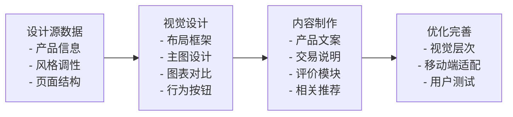
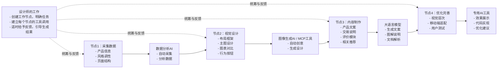
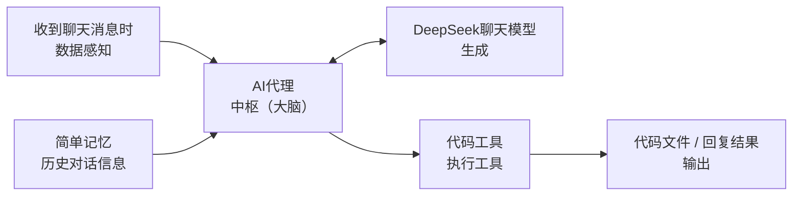

---
为了帮助大家更直观地了解“流程自动化”这一关键性思维理念，让我们首先从跟我们息息相关的电商产品详情页设计过程入手，讲解“设计自动化”相较于传统的手工设计流程所展现出的显著优势。

我们的目标是弄明白：为了成功实现“流程自动化”，必须包含哪些核心模块和关键工具？

今天的课程会比以往几次的持续时间都更长，我希望大家通过这节课的学习，能全面理解并掌握“流程自动化”的核心要义，从而在实际工作中提升设计效率和创新能力。

## 什么是“流程化设计”与“低代码工作流”？

### 设计流程自动化的阶段演化

设计是一种将设想通过合理的规划以各种方式表现出的过程，是一项可以流程化的工作。
斯坦福大学的设计思维模型将设计分为“**共情**、**定义**、**构思**、**原型**、**测试**”五个具有先后顺序关系的步骤，这也是宏观意义上设计流程化的体现。

具体而言，流程化设计是指将设计工作分解为一系列标准化、可重复执行的步骤，通过系统化的方法来提高设计效率和质量。它强调将复杂的设计任务拆解为可管理的模块，每个模块都有明确的输入、处理过程和输出结果。

下面以一个简单的电商产品详情页的设计过程为例，来讲解一般的流程化设计步骤。

**步骤1：获取设计源数据。**

- 收集产品信息，如产品名称、规格参数、价格、卖点等。
- 确定设计风格和品牌调性，如详情页主视觉、品牌识别等。
- 制定页面结构和信息层级，如版面尺寸、排版规范等。

**步骤2：视觉设计。**

- 创建页面布局框架，如头部、产品展示区、参数说明区、用户评价区等。
- 设计产品主图和细节图的展示方式。
- 制作产品参数表格和对比图表。
- 设计购买按钮和行动号召元素。

**步骤3：内容制作。**

- 编写产品描述文案。
- 制作产品特性图标。
- 设计用户评价展示模块。
- 制作相关推荐产品展示。

**步骤4：优化完善。**

- 进行视觉层次优化。
- 调整色彩搭配和字体选择。
- 优化移动端适配。
- 进行用户测试和反馈收集。

如下面这个流程图所示，通过这种流程化的方法，整个复杂的电商产品详情页设计流程变成了有迹可循、条理清晰的可执行步骤。在每个步骤中，都有细化的可完成事项。在这样的流程化设计中，设计师可以确保每个环节都得到充分考虑，避免遗漏重要信息，同时提高工作效率。

**电商产品详情页的流程化设计示意图**

虽然流程化设计为设计工作带来了结构化的方法，但完全由设计师手动操作的流程化设计仍然存在诸多局限性。

- **重复性工作占用了大量时间**设计师需要为每个新产品重复执行相同的设计步骤，如创建相同的布局框架、调整相同的产品展示模块等。这种重复性工作不仅耗时，还容易导致设计师的创意疲劳，影响设计质量。

- **传统流程化设计缺乏数据驱动的优化能力**设计师往往基于经验和直觉做设计决策，缺乏对用户行为数据的实时分析。例如，无法快速了解哪些产品展示方式更受用户欢迎，哪些购买按钮的位置和样式转化率更高，哪些产品参数是用户最关心的。这种信息不对称导致设计优化缺乏科学依据，难以实现持续改进。

- **传统流程化设计在协作和沟通方面存在效率问题**设计师需要与产品经理、开发工程师、市场人员等多个角色进行频繁沟通，协调设计需求和实现方案。这种多角色协作往往导致信息传递失真、需求变更频繁、项目进度延误等问题。特别是在大型项目中，协调成本可能超过实际设计成本。

- **传统流程化设计难以应对快速变化的市场需求**当产品需要快速迭代，营销活动需要及时响应，用户反馈需要快速处理时，传统的手工设计流程往往显得过于缓慢和僵化。设计师需要花费大量时间在重复性工作上，而无法专注于更有价值的创意和策略思考。

在人工智能等先进科技迅速发展的今天，上述局限性都有了能够解决的方案：

	自动化技术和工具的引入能够使设计师仅需简单拖拽界面组件或使用自然语言，即可控制流程化设计的自动进行。这不仅提升了整个设计工作的效率，更让设计拥有更广阔的探索空间。

设计流程自动化的发展历程可以分为三个主要阶段。

**第一阶段：AI工具出现之前的自动化探索（2000—2010年）。**

此时的设计流程自动化主要依赖于传统的软件工具和脚本编程。这一阶段的特点是工具相对简单，自动化程度有限。例如，Adobe Creative Suite 提供了动作（Actions）功能，允许设计师录制一系列操作步骤，然后批量应用到多个文件上。这对于处理大量相似的设计任务非常有用。然而，此时的自动化程度仍然受限于软件自身预设的功能。

**第二阶段：AI工具初步应用期（2010—2020年）。**

随着机器学习技术的发展，AI工具开始在设计领域崭露头角，为设计流程的自动化带来新的可能性。在图像处理领域，AI技术开始用于自动化的图像优化和风格转换。例如，Adobe Sensei 技术可以自动识别图像中的主体，进行智能裁剪和背景处理。然而，这一阶段的AI工具精度不高，几乎没有创造性，同时还需要大量人工干预。

**第三阶段：AI工具深度集成期（2020年至2025年）。**

AI技术在设计领域的应用进入了爆发期，设计流程的自动化达到了前所未有的高度。这一阶段的特点是AI工具与工作流自动化平台的深度集成，形成了完整的自动化设计生态系统。在工作流自动化方面，n8n、Zapier、Make 等平台成了连接各种AI工具和设计软件的重要桥梁。这些平台提供了可视化的流程设计界面，允许设计师通过拖拽方式创建复杂的自动化工作流。除此之外，各平台还能够通过 API 调用各种通用AI模型和所需工具，这种深度集成为设计流程的自动化带来了革命性的变化。

在这样的时代背景下，作为设计师的我们需要建立一种设计自动化的思维，打破舒适区，学习一定的技术知识，支撑我们利用现有的先进科技自动地、智能地完成相应任务，从而更有质量、更有效率地完成设计工作。

---
### 自动化不是替代，而是加速

或许在AI日益强大的今天，我们会担心人类的工作是否会被完全替代。
实际上，我们必须明确一个核心观念：

	自动化不是为了替代人，而是为了提高人的工作效率，让人能够专注于更有创造性和战略性的工作。

这种人机协同的关系建立在AI工具与人各自优势互补的基础上。

AI工具的优势在于处理大量数据、执行重复性任务、进行模式识别和快速生成内容。它们可以24小时不间断工作，不会感到疲劳，能够同时处理多项任务，并且在数据处理和计算方面具有人类无法比拟的速度和精度。而设计师的优势则在于创造性思维、多元化的审美判断、用户体验和战略规划。设计师能够理解用户的情感需求，创造有意义的视觉体验，进行创新性的设计思考，并做出基于人类价值观的设计决策。

正是这种优势互补，使得AI工具与设计师的协同成为可能。然而，我们可能会担心，作为设计师是否有足够的编程能力去使用这样的AI工具。好消息是，大部分自动化工具或平台都能够提供“低代码工作流”的创建。所谓“低代码工作流”，即设计师在创建这样的工作流时，并不需要像程序员一样编写过多的代码，而只需要利用可视化界面便可以完成工作流的创建。这样的工作流创建方式弥补了设计师在编程能力上的“差距”，让设计师能够轻松使用具有强大功能的自动化工具。

下面以电商产品详情页的流程化设计为例，详细讲解如何利用自动化帮助设计师优化工作流程，实现更高效的设计过程。

**步骤1：加快数据收集与分析。**

在传统设计流程中，设计师需要手动收集产品信息、分析品牌调性、制定设计规范，这个过程往往耗时且容易出错。而通过自动化技术，这些工作可以被显著加速。

AI工具可以自动收集和整理产品信息。通过集成电商平台的 API，AI系统可以自动获取产品的名称、规格参数、价格、库存、用户评价等关键信息，并按照预设的格式进行整理。除此之外，AI工具可以自动分析品牌调性和设计风格，自动生成设计规范和模板。例如，我们可以在此节点调用大语言模型，并让其自动获取信息，生成结构化的分析文档。

**步骤2：AI辅助进行视觉设计。**

视觉设计阶段是设计流程中最具创造性的部分，但即使在这个阶段，也有很多工作可以通过自动化技术来加速。我们可以在此节点创建AI和 MCP 服务，使其能够调用所需的设计软件，为我们自动生成一系列可供参考的原型图，而设计师只需要进行部分调整。

例如，在页面布局方面，AI工具可以使用 MCP 连接到 Figma 软件，直接根据设计师的自然语言指令生成可自由修改的低保真原型图。除此之外，许多多模态模型也可以用于生成商品展示图、数据可视化等内容。

**步骤3：内容制作加速。**

内容制作阶段涉及大量的文案创作和视觉元素制作，其中部分内容仍然可以通过AI工具来加速。

在文案创作方面，AI工具可以自动生成产品描述、特性说明、营销文案等。通过分析产品特性和目标用户群体，AI系统可以生成符合品牌调性的文案内容。虽然这些文案可能需要设计师进行润色和调整，但AI生成的初稿可以大大降低文案创作的时间成本。

在用户评价展示方面，AI工具可以自动整理和分析用户评价数据。通过自然语言处理技术，AI系统可以自动提取用户评价中的关键信息，生成评价摘要、情感分析结果、关键词统计等，并自动生成评价展示模块的设计方案。

**步骤4：优化与交付的加速。**

在最终的优化完善及交付阶段，设计师一般需要做大量的测试以确保整个设计具备完备性，而在AI工具的帮助下，部分测试流程和分析过程都可以自动化地实现。

例如，在视觉层次优化方面，具备多模态能力的AI模型可以自动分析设计稿的视觉层次和用户注意力的分布；在移动端适配方面，AI工具可以调用设计软件自动生成响应式设计方案；在用户测试方面，AI也可以自动收集和分析用户反馈数据。这些数据可以帮助设计师快速了解设计效果，进行有针对性的优化。

如下面这个流程图所示，在整个设计流程的自动化中，诸如数据采集与分析、生成初步的视觉设计与文案等工作，都可以轻松地交由自动化工具中的AI完成。而设计师主要的工作就是建立这个工作流，找到相应的工具，然后等待AI完成自动化内容后，再给出相应的建议与反馈，以此来逐步引导，最终得到预期的结果。

**自动化赋能的电商产品详情页设计流程示意图**

我们可以将每一个工作节点看作公司的一个部门，其中的每个AI工具都是部门的一名员工，而设计师就是统领整个公司的管理者，负责进行更高层次的统筹分析与创意思考。在这样的协作模式下，设计师能够与AI深度协同，加速整个设计生产流程。

---
## 自动化设计的组成模块

### 数据感知、生成、执行和输出

就如同设计师对一个庞大的设计工作进行逐步分解、逐渐完善的过程一样，在自动化工作流的创建过程中，我们会将任务分解成一个个小任务，并为每个小任务分配相应的自动化工具，如AI模型、调用工具等，来确保这个小任务能够被完成。在技术领域，将这种“小任务”称为“工作节点”。

那么一个工作节点都包括哪些东西呢？可以回想一下做设计工作的时候，首先是获得了来自外界的一个目标或任务，然后进行思考，直到有一个想法浮现在脑海里，紧接着我们使用工具去实现它，最后得到了一个可以交付的作品。这四个步骤实际上与工作节点中所包括的环节相似：数据感知、生成、执行和输出。

可以用一个例子来解释自动化工作流是如何实现的。如图6-3所示，这是利用软件 n8n 设计的一个与 DeepSeek 模型对话的工作节点。

**创建一个设计代码的工作流流程示意图**

**1. 数据感知**

数据感知模块是自动化工作流的起点，负责从各种数据源收集、识别和处理原始信息。在这个工作流中，数据来源是我们的“聊天消息”，以及一些关于我们之前对话的“简单记忆”。

**2. 生成**

数据和任务目标通过代理传达给AI模型，并生成相关的答案或任务行为。在这个工作流中，我们通过自然语言表达的目标“编写一段代码”被转换为可识别的数据格式，并通过代理传达给 DeepSeek 模型进行解析。DeepSeek 在理解我们的需求后，会返回代理所需要的答案。

**3. 执行**

执行模块负责将生成的内容转化为实际的设计作品，执行各种设计任务和操作。在这个工作流中，代理接收到 DeepSeek 返回的答案后，通过调用代码编写工具，完成代码的编写。

**4. 输出**

输出模块是自动化设计系统的终点，负责将完成的设计作品交付给用户，并收集反馈信息用于系统优化。在这个工作流中，代理收到代码工具生成的代码文件后，将其交付给用户，即完成了整个工作流的任务。

实际上，这只是一个最简单的工作流创建，却已经包括了完整的四个组成部分。在一些复杂的工作流中，每个步骤都可能涉及不同工具、API 的调用。例如，在数据感知阶段，可以通过 HTTP 请求节点调用产品的 API，获取详细的商品数据和用户评价；在生成阶段，可以通过 API 连接到各种AI模型；在执行阶段，可以通过 MCP 服务控制如 Figma、Blender 等设计软件，自动生成相应的设计原型。

---
### 市面上的自动化工具：n8n、Make、Zapier、Cursor、Coze、Trae

目前市面上有多种可以实现设计流程自动化的工具可供选择，但每种工具涵盖的应用场景、本身的优劣势，以及对不同设计任务的适配程度都存在差异。

下面这张表围绕不同的设计任务，对比了当前流行的6种可以实现自动化的工具。

| 工具     | 应用场景                   | 优劣势                        | 适配设计任务                                 | 外部调用支持（API / LLM）                           |
| ------ | ---------------------- | -------------------------- | -------------------------------------- | ------------------------------------------- |
| n8n    | 复杂工作流自动化，如数据同步、跨平台协作   | 优势：开源、高度自定义、本地部署；劣势：学习难度较大 | 平面设计（批量处理）、电商设计（库存同步）、网页设计（CMS 更新）     | API 支持强，可调用外部服务；LLM 支持强                     |
| Make   | 多步骤自动化，如营销活动、客户管理      | 优势：可视化逻辑、海量模板；劣势：高级功能需付费   | 文案设计（内容分发）、电商设计（订单跟踪）、App 原型设计（用户反馈收集） | API 支持强，支持 Webhooks；LLM 支持弱，依赖第三方插件         |
| Zapier | 简单任务自动化，如邮件触发、社交媒体发布   | 优势：易用性强、集成广泛；劣势：价格高、逻辑简单   | 平面设计（自动导出）、文案设计（多平台发布）、视频生成（触发渲染任务）    | API 支持中等，但调用次数受限；LLM 支持弱，仅通过 Zapier AI 有限集成 |
| Cursor | 代码辅助设计，如生成 UI 代码、自动化测试 | 优势：AI 驱动、开发友好；劣势：需要编程基础    | 网页设计（代码生成）、App 原型设计（自动生成组件）            | API 支持弱，专注代码生成；LLM 支持强（内置 GPT-4）            |
| Coze   | AI 驱动设计，如生成文案、图像       | 优势：多模态 AI、快速原型；劣势：输出需要人工优化 | 平面设计（AI 作图）、文案设计（多语言生成）、视频生成（脚本创作）     | API 支持弱；LLM 支持强（集成多种模型，如 DALL·E 3）          |
| Trae   | 电商设计自动化，如产品页生成、A/B 测试  | 优势：电商垂直优化；劣势：场景局限          | 电商设计（自动生成商品页）、平面设计（促销素材）               | API 支持中等，支持电商平台调用；LLM 支持弱，仅用于基础文本生成         |

**市面上常见的自动化工具对比**

面对如此多的自动化工具，我们要根据自己的具体需求和技能水平来选择合适的工具。

以下是一些建议：

1. 对于没有代码基础、不使用代码的运营同学，建议选择 Zapier、Make。这些工具都具有良好的可视化图形界面，运营同学能够通过拖拽组件的方式建立工作节点和搭建流程。
2. 对于需要强大AI辅助功能的运营同学，建议选择 Coze。它专注于AI应用的开发，提供了丰富的AI工具和模型。
3. 对于具备代码基础、需要生成代码实现的运营同学，建议选择 n8n 或 Cursor。这些工具提供了最大的灵活性和自定义能力，可以处理复杂的自动化场景，但需要一定的技术基础。
4. 对于需要处理复杂数据的场景，建议选择 Make。它的数据处理能力强大，适合需要数据转换和集成的场景。
5. 对于简单的任务自动化，建议选择 Zapier。它简单易用，适合快速实现基本的自动化需求。

无论选择哪种工具，各位运营同学都应该从最简单的自动化开始，一步一步学习如何使用这项技术，逐步增加复杂程度，在实践中不断学习和优化。
